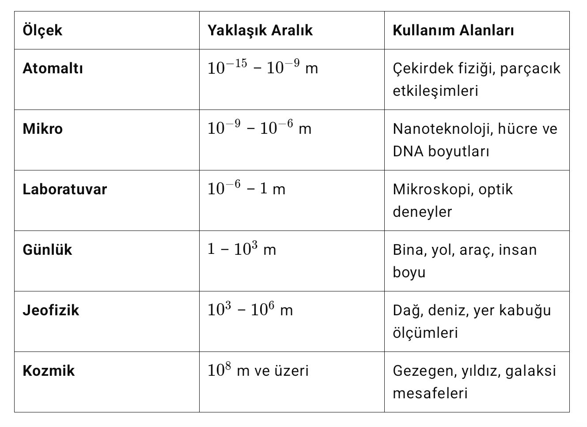
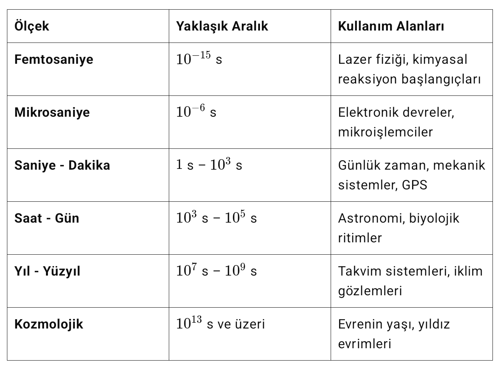
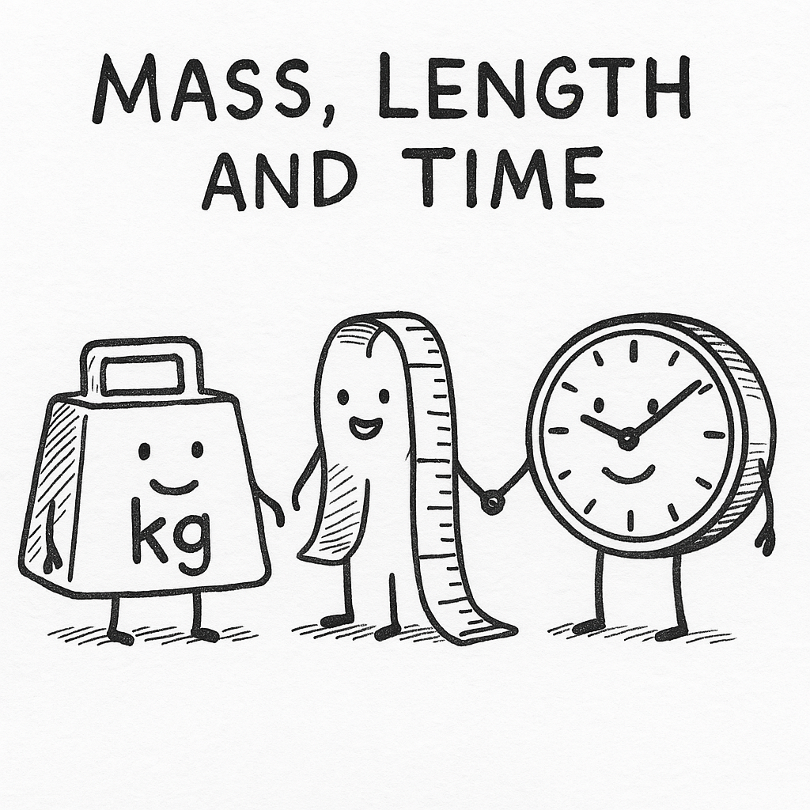

### Bölüm İçeriği
1. Fizik Bilimine Giriş
2. Evrenin Temel Yapısı Üzerine Bir Bakış
3. Ölçme ve Birimler
4. Uluslararası Birim Sistemi (SI)
5. Kütle
6. Uzunluk
7. Zaman

## **1. Fizik Bilimine Giriş**
---

Fizik, madde, enerji ve bunlar arasındaki etkileşimleri inceleyen temel bir doğa bilimidir. Evrenin en küçük yapı taşlarından en büyük kozmik yapılara kadar her ölçekten olguyu anlamaya çalışır. Gözlem, deney ve matematiksel modellemeye dayanarak doğa yasalarını ortaya koyar; bu yasalar evrenin işleyişini açıklamakla kalmaz, aynı zamanda teknolojik gelişmelerin temelini oluşturur.

Kısacası fizik, doğayı anlama çabasının evrensel dilidir.

> Fizik kelimesi, Yunanca physis (φύσις) “doğa” sözcüğünden gelir. Doğayı anlamaya çalışan bilgi disiplini anlamında ilk kez Antik Yunan filozofları tarafından kullanılmıştır.

### **1.1. Fizik, Doğayı Anlamanın Temelidir**  
___
Fizik bilimi, evrendeki tüm doğal olayları açıklamaya yönelik en temel bilimsel disiplindir. Serway’e göre, hareket eden bir aracın hızından yıldızların evrim sürecine kadar gözlemlenen her olgu, fizik yasaları çerçevesinde anlaşılabilir. Bu anlayışın arkasında iki temel gerçek yatar:

Evrenin tüm sistemleri, enerji ve madde üzerine inşa edilmiştir.

Bu iki unsuru yöneten yasalar –Newton mekaniği, Maxwell denklemleri, Schrödinger denklemi gibi– fiziğin merkezinde yer alır.

Fizik, bu nedenle yalnızca doğayı açıklamakla kalmaz; aynı zamanda evrenin işleyişini anlamamız için bir çerçeve sunar.

### **1.2. Fizik, Diğer Bilimlerin Temelidir**
---
Halliday'e göre fizik, doğa bilimlerinin yapı taşıdır. Kimya, biyoloji ve hatta tıp gibi bilim dallarının temelinde fiziksel yasalar yer alır:

Atomun yapısı, kuantum fiziği ile tanımlanır.

Hücre içi iyon hareketleri, elektrostatik yasalarla açıklanır.

Kalp ve damar sisteminin dinamiği, basınç ve akışkanlar mekaniği bilgisiyle anlaşılır.

Bu bağlamda fizik, yalnızca doğa bilimlerine değil, yaşam bilimlerine de yön verir.

### **1.3. Fizik, Günlük Yaşamın Bir Parçasıdır**
---
Feynman, fiziği yalnızca laboratuvarlara hapseden bir anlayışa karşı çıkar. Ona göre fizik, gündelik yaşamın her anında karşımıza çıkar:

Işığın su yüzeyinde kırılması, optik ilkeleriyle açıklanır.

Akıllı telefonların çalışması, elektromanyetik dalgaların denetimindedir.

Mikrodalga fırınlar, buzdolapları ve bilgisayarlar gibi cihazlar, fizik yasalarının mühendislik uygulamalarıdır.

Fizik, böylece yaşadığımız dünyayı anlamak için bir rehber işlevi görür.

### **1.4. Fizik, Teknolojik Gelişmelerin Motorudur**
---
MIT derslerinde fizik, çağımızın teknolojik dönüşümünün itici gücü olarak tanımlanır:

Roketler ve uydular, klasik mekanik ve kütleçekim fiziği üzerine kuruludur.

Nükleer enerji, modern fiziğin (özellikle çekirdek fiziğinin) bir ürünüdür.

Yapay zeka ve mikroçip teknolojisi, kuantum fiziği ve elektromanyetik teorilerin mühendislik ürünü uygulamalarıdır.

Fizik, bu yönüyle yalnızca doğayı anlamakla kalmaz; geleceği inşa etmenin temel aracıdır.

### **1.5. Fizik, Matematiğin Kalemiyle Evreni Yazar**
---
Stephen Hawking’in sözleriyle ifade edecek olursak:

“Evren bir matematik kitabı gibidir; ancak bu kitabı okumak için fizik bilmek gerekir.”

Evrendeki düzen, dört temel kuvvetin (kütleçekim, elektromanyetizma, zayıf ve güçlü nükleer kuvvetler) etkileşimi ile şekillenir. Bu kuvvetler, yalnızca fizik kuramları aracılığıyla tanımlanabilir ve anlaşılabilir.

**Uygulama ve Pekiştirme**

**Soru**:
Fizik biliminin diğer bilimlerle olan ilişkisini açıklayınız. Kalp-damar sisteminin işleyişi hangi fiziksel ilkelere dayanır?

**Uygulama**:
Günlük hayatınızda kullandığınız üç teknolojik cihaz seçin. Her biri için hangi fizik yasalarının geçerli olduğunu açıklayın.

**Kaynaklar:**

Serway & Jewett – Physics for Scientists and Engineers, Chapter 1

Halliday & Resnick – Fundamentals of Physics, Introduction Chapter

Feynman Lectures on Physics, Vol. I, Chapter 2

MIT OpenCourseWare – Classical Mechanics (8.01), Lecture 1

Stephen Hawking – A Brief History of Time

## **2. Evrenin Temel Yapısı Üzerine Bir Bakış**
---

> Atom, Yunanca a-tomos yani “bölünemez” anlamındadır. Antik Yunan'da maddenin en küçük parçası olduğu düşünülmüştür; ancak modern fizik atomun da alt parçacıklardan oluştuğunu ortaya koymuştur.

Parçacık fiziği, doğadaki en küçük yapı taşlarını ve bunların etkileşimlerini inceleyen fizik dalıdır. Bu alan, evrenin temel bileşenlerini ve onların nasıl etkileşime girdiğini anlamamıza olanak tanır. Modern parçacık fiziği, Standart Model adı verilen kuramsal çerçeveye dayanır. Bu modele göre, tüm madde ve kuvvetler üç temel parçacık ailesi ile açıklanır:

### **2.1. Temel Parçacıklar**
---
**Kuarklar**: Proton ve nötron gibi bileşik parçacıkları oluşturan yapıtaşlarıdır. Altı çeşittir: yukarı, aşağı, tılsım, garip, üst ve alt kuark.

**Leptonlar**: Elektron, müon, tau ve bu parçacıkların nötrinoları bu gruba dahildir.

**Bozonlar**: Kuvvet taşıyıcı parçacıklardır.

**Foton**: Elektromanyetik kuvveti taşır.

**Gluon**: Kuarklar arası güçlü etkileşimi taşır.

**W ve Z bozonları**: Zayıf nükleer kuvvetin taşıyıcılarıdır.

**Higgs bozonu**: Parçacıklara kütle kazandıran alanın kuantumudur.

### **2.2. Temel Kuvvetler**
---
Parçacıklar arasındaki tüm etkileşimler dört temel kuvvetle açıklanır:

**Güçlü nükleer kuvvet**: Kuarkları bir arada tutan kuvvettir.

**Zayıf nükleer kuvvet**: Radyoaktif bozunmalarda ve nükleer tepkimelerde rol oynar.

**Elektromanyetik kuvvet**: Elektriksel ve manyetik etkileşimlerin temelidir.

**Kütleçekim kuvveti**: Kütleli cisimlerin birbirine uyguladığı evrensel çekim kuvvetidir. (Henüz Standart Model’e tam olarak entegre edilememiştir.)
Bu yapı sayesinde evrendeki tüm maddesel ve kuvvetsel süreçler mikroskobik ölçekte açıklanabilir hale gelir.

### **2.3. Evrenin Genişlemesi: Kozmik Ölçekte Hareket ve Evrim**
---
Evren, durağan bir yapı değil; sürekli olarak genişleyen dinamik bir sistemdir. Bu genişleme, ilk kez 20. yüzyılın başlarında yapılan astronomik gözlemlerle ortaya konmuş ve kozmolojinin temel taşlarından biri hâline gelmiştir. Bugün bildiğimiz şekliyle evrenin genişlemesi, Büyük Patlama (Big Bang) kuramıyla açıklanır.

**1. Gözlemsel Kanıt: Hubble Yasası**

1929 yılında Edwin Hubble, uzak galaksilerin ışığının kırmızıya kayma gösterdiğini fark etti. Işığın dalga boyunun uzaması (kırmızıya kayması), bu galaksilerin bizden uzaklaştığını gösterir. Bu gözlem, evrenin durağan olmadığını, aksine her yönde genişlemekte olduğunu ortaya koymuştur.

Hubble Yasası:  
$$v=H_{0}.d$$

Burada, $v$ galaksinin uzaklaşma hızı,  $d$ mesafesi ve $H_{0}$ Hubble sabitidir. Bu yasa, evrendeki genişlemenin hızını tanımlar.

**2. Kozmik Mikrodalga Arka Plan (CMB)**

1965’te keşfedilen kozmik mikrodalga arka plan ışıması, Büyük Patlama’dan kalan ışımanın günümüze ulaşmış hâlidir. Bu ışıma, evrenin başlangıcında aşırı sıcak ve yoğun bir halde olduğunu ve zamanla soğuyup genişlediğini doğrular.

### **2.4. Karanlık Enerji ve İvmelenen Genişleme**
---
1998 yılında yapılan süpernova gözlemleri, evrenin sadece genişlemediğini, aynı zamanda bu genişlemenin giderek ivmelendiğini gösterdi. Bu şaşırtıcı bulgu, evrende baskın bir rol oynayan ancak doğası hâlâ tam anlaşılamamış bir enerji biçiminin varlığını ortaya koydu: karanlık enerji.

Karanlık enerji, evrenin %68’ini oluşturarak kozmik genişlemeyi hızlandıran baskın kozmolojik bileşen olarak kabul edilir.

**Temel Kavramlar**:

**Kırmızıya kayma (redshift)**: Işık kaynağı uzaklaştıkça, yayılan ışığın dalga boyu uzar. Gözlenen spektrumda kırmızıya doğru bir kayma olur.

**Kozmolojik ilke**: Evrenin büyük ölçeklerde izotropik (yönsüz) ve homojen (yer yönünden eşit) olduğu varsayımıdır.

**Karanlık enerji**: Evrenin ivmeli genişlemesini açıklamak için öne sürülen enerji türü; negatif basınca sahip olduğu düşünülür.

**Uygulama ve Pekiştirme**

**Soru**:
Bir elektron ile proton arasındaki elektromanyetik etkileşim neden kütleçekim etkisinden çok daha büyüktür? Sayısal olarak kıyaslayın.

**Uygulama**:
Standart Model’deki temel parçacıkları tabloya yerleştirin: kuarklar, leptonlar, bozonlar.

**Kaynaklar**:

Griffiths, D. (2008). Introduction to Elementary Particles.

Halzen, F., & Martin, A. D. (1984). Quarks and Leptons: An Introductory Course in Modern Particle Physics.

CERN. (2024). The Standard Model. https://home.cern/science/physics/standard-model

Hubble, E. (1929). A Relation between Distance and Radial Velocity among Extra-Galactic Nebulae, PNAS.

Planck Collaboration. (2020). Planck 2018 results. VI. Cosmological parameters, Astronomy & Astrophysics.

Peebles, P. J. E. (2020). Cosmology’s Century: An Inside History of Our Modern Understanding of the Universe.

NASA / ESA – Cosmic Background Explorer (COBE), Supernova Cosmology Project

## **3. Ölçme ve Birimler**
---

Fizik, doğayı nicel olarak anlamaya çalışan bir bilim dalıdır; bu nedenle ölçüm ve ifade netliği büyük önem taşır. Fiziksel büyüklükler yalnızca sayılarla değil, aynı zamanda bu sayıların hangi standarda göre belirlendiğiyle anlam kazanır. İşte bu standardı belirleyen şey birimlerdir.

### **3.1. Birimlerin Anlamı ve Önemi**
---

Bir fiziksel büyüklük, sayısal değer × birim biçiminde tanımlanır. Örneğin bir cismin kütlesi "5" değil, "5 kilogram" olarak anlamlıdır. Bu bağlamda birimler:

**Tutarlılık sağlar**: Fiziksel yasalar ancak doğru birimler kullanıldığında geçerli olur. Örneğin, $$F=ma$$
denkleminde,  kuvvet newton (N),  kütle kilogram (kg) ve  ivme metre/saniye² (m/s²) ile ifade edilmelidir.

**Karşılaştırma olanağı sunar**: Aynı büyüklük farklı yer ve zamanlarda ölçüldüğünde birimlerin ortaklığı, sonuçların karşılaştırılabilir olmasını sağlar.

**Boyut analizi yapmaya olanak tanır**: Birim analizi, denklem doğruluğunu sınamak ve yeni ilişkiler türetmek için güçlü bir araçtır. Örneğin enerji biriminin boyutu: $$[E]=[M][L]^2[T]^{-2}$$

### **3.2. Bilimsel Hatalar ve Birim Uyumsuzluğu**
---
Birim hataları, bilimsel ve mühendislik çalışmalarında ciddi sonuçlara yol açabilir. Örneğin:

**Mars Climate Orbiter (1999)**:
NASA’nın Mars görevindeki uzay aracı, yönlendirici kuvvet hesaplarında bir tarafın İngiliz birimi olan "pound-force", diğer tarafın SI birimi olan "newton" kullanması nedeniyle hatalı yörüngeye girdi ve kayboldu. Bu olay, birim uyumsuzluklarının milyar dolarlık sonuçlara yol açabileceğini açıkça göstermektedir.

### **3.3. Uluslararası Birim Sistemi (SI): Evrensel Ölçüm Dili**
---

Bilimsel iletişimin ortak paydası olan Uluslararası Birim Sistemi (SI), 1960 yılında kabul edilerek modern fiziğin, kimyanın ve mühendisliğin temelini atmıştır.

Bu sistem, yalnızca ölçüm yapmanın bir yöntemi değil; doğayı sayılarla anlamanın evrensel dilidir.

SI sistemi, evrendeki temel büyüklükleri yedi ana başlık altında sınıflandırır. Bu büyüklüklerin her biri, zaman içinde gelişen teknoloji ve artan ölçüm hassasiyetiyle birlikte doğa sabitlerine dayalı olarak yeniden tanımlanmıştır. Böylece sistem; sadece evrensel ve tekrarlanabilir değil, aynı zamanda doğanın kendisine referans veren bir ölçüm çerçevesi hâline gelmiştir.

### **3.4. 2019 Güncellemesi: Doğa Sabitlerine Dayalı Tanımlar**
---

Uluslararası Birimler Sistemi (SI), 2019 yılında yapılan düzenlemelerle birlikte, temel birimlerin tanımını doğrudan ölçülemeyen fiziksel nesnelere değil, doğanın değişmez ve evrensel sabitlerine dayandırarak yeniden yapılandırılmıştır. Bu yaklaşım, birimlerin tanımında daha büyük bir kesinlik, evrensellik ve süreklilik sağlar. Artık tüm SI temel birimleri, yedi sabitin sabitlenmiş sayısal değerleri üzerinden tanımlanmaktadır.

### **3.5. SI Sisteminin Özellikleri**
---

**Evrensellik**: Dünya genelinde bilimsel ve teknolojik iletişimde ortak dil oluşturur.

**Tutarlılık**: Temel ve türetilmiş birimler arasında matematiksel bütünlük sağlar.

**Doğruluk**: 2019 yılında doğa sabitlerine dayalı tanımlar ile daha yüksek kesinlik sunar.

**Kullanım kolaylığı**: Metrik yapısı sayesinde 10’un katlarıyla kolay dönüşüm sağlar.

### **3.6. Ön Ekler**
---

Evren, hem atom altı parçacıkların dünyasında hem de galaksiler arası uzaklıklarda gizlidir. İşte bu uçsuz bucaksız ölçekte fiziksel büyüklükleri anlamlı biçimde ifade edebilmek için SI ön ekleri, bilim insanlarına mükemmel bir araç sunar.

Bu ön ekler, sayıların başına eklenen küçük hecelerden ibaret görünse de, aslında ölçeğin dilidir.

Bir "nano" ile DNA’nın yapısına iner, bir "giga" ile yıldızlararası veri akışını ölçersiniz.

Ölçümde pratiklik, dilde sadelik ve anlamda evrensellik arayan bilim insanları için bu ön ekler, sayılarla kurulan cümlelerin yapı taşlarıdır. Metrik sistemin 10 tabanlı yapısı sayesinde, büyüklükler kolayca küçültülüp büyütülebilir; böylece bilimsel ifadeler hem daha okunabilir hem de daha karşılaştırılabilir hâle gelir.

**Uygulama ve Pekiştirme**

**Soru**:
Bir enerji denkleminin boyut analizini yapınız: $$E = \frac{1}{2}mv^2$$SI birimlerini kullanarak doğruluğunu kontrol ediniz.

**Uygulama**:
Bir cismin kütlesini pound cinsinden ölçtüğünüzü varsayın (örnek: 150 lb). Bu değeri kilogram cinsine çevirin.

**Kaynaklar**:

BIPM. (2019). The International System of Units (SI), 9th Edition.

Taylor, B. N., & Thompson, A. (2008). The International System of Units (SI), NIST SP 330.

Halliday, Resnick & Walker. Fundamentals of Physics, Chapter 1.

NASA. Mars Climate Orbiter Mishap Investigation Board Phase I Report (1999).

https://physics.nist.gov/cuu/Units/units.html

## **4. Kütle**
---

Kütle, bir cismin içerdiği madde miktarını ve bu cismin fiziksel süreçlerdeki davranışını belirleyen temel bir büyüklüktür. Hem hareket (dinamik sistemler) hem de kütleçekim (gravitasyonel etkileşimler) açısından fiziksel sistemlerin çözümlemesinde vazgeçilmez bir rol oynar.

### **4.1. Kütlenin Fiziksel Anlamı**
---

**Eylemsizlik özelliği**: Newton’un ikinci yasası  çerçevesinde, kütle, bir cismin hareket durumundaki değişime karşı gösterdiği direnci belirler.

**Kütleçekim etkisi**: Newton’un evrensel kütleçekim yasasına göre, iki kütleli cisim birbirine çekim kuvveti uygular:

$$F=G\dfrac{m_1m_2}{r^2}$$

Burada, $m_1$ ve $m_2$ kütleler,  $r$ aralarındaki mesafe ve $G$ evrensel kütleçekim sabitidir.

Kütle, skaler bir büyüklüktür; yalnızca büyüklük içerir, yönü yoktur. Ayrıca bulunduğu konumdan bağımsızdır: Dünya’da, Ay’da veya uzay boşluğunda değişmez. Bu yönüyle kütle, cismin evrensel bir özelliğidir.

### **4.2. Kilogram: Kütlenin SI Birimi**
---

Kilogram (kg), Uluslararası Birimler Sistemi'nde (SI) tanımlanmış yedi temel birimden biridir ve kütle ölçümlerinde referans büyüklük olarak kullanılır.

**Sembolü**: kg

**Dönüşümler**: 1 kg = 1000 gram (g) ≈ 2.2046 pound (lb) ≈ 35.274 ons (oz) ≈  dalton

### **4.3. Tarihsel Gelişim**
---

**1795**: Kilogram, bir litre (1 dm³) saf suyun 4 °C’deki kütlesi olarak tanımlandı.

**1799**: “Kilogramme des Archives” adlı platin silindir referans olarak kabul edildi.

**1889**: Paris'teki BIPM laboratuvarında saklanan platin-iridyum alaşımından yapılmış Uluslararası Kilogram Prototipi (IPK) resmen standarda dönüştü ve 130 yıl boyunca tüm dünya bu nesneye göre ölçüm yaptı.
Ancak fiziksel prototip zamanla kütle kaybedebileceği için daha kararlı ve evrensel bir tanım arayışına girildi.

### **4.4. Modern Tanım (2019 ve Sonrası**)
---

2019 yılında yürürlüğe giren yeni tanımla birlikte, kilogram artık fiziksel bir nesneye değil, doğa sabitlerine dayalı olarak tanımlanmıştır. Bu tanım üç temel sabite dayanır:

- **Planck sabiti (h)**

- **Işık hızı (c)**

- **Sezyum-133 atomunun geçiş frekansı**

**1 kilogram**, Planck sabitinin sayısal değeri
$$h=6.62607015\times 10^{-34} \text {J.s}$$
olacak şekildedir.

Bu tanımın uygulanmasında kullanılan cihaz, Kibble (eski adıyla Watt terazisi) terazisidir. 

Bu cihaz, elektromanyetik kuvvet ile kütle kuvveti arasındaki ilişkiyi hassas şekilde ölçer.

Yeni tanım ile eski IPK tanımı arasındaki fark milyonda yalnızca 30 birim düzeyindedir.

Bu fark, yalnızca ultra hassas bilimsel deneylerde önemlidir; günlük kullanımda ölçümler etkilenmez.

Modern tanım sayesinde kilogram, değişmez, tekrarlanabilir, evrensel bir ölçü standardı hâline gelmiştir.

### **4.5. Kütle Ölçekleri ve Kullanım Alanları**
---

**Uygulama ve Pekiştirme**

**Soru**:
Ay’daki yerçekimi Dünya’nınkinin yaklaşık 1/6’sıdır. Dünya’da 60 kg olan bir cismin Ay’daki ağırlığı ne olur? Kütlesi değişir mi?

**Uygulama**:
Kütle ile ağırlık arasındaki farkı örneklerle açıklayın. Bir tablo yaparak Dünya, Ay ve Jüpiter’de aynı cismin ağırlığını kıyaslayın.

**Kaynaklar**:

BIPM. (2019). The International System of Units (SI), 9th Edition.

NIST. (2020). SI Redefinition: Kilogram and Planck Constant.

Taylor, B. N., & Thompson, A. (2008). The International System of Units (SI), NIST SP 330.

Pera Müzesi Blog. (2021). “Büyük K’nin Serüveni”.

https://www.nist.gov/si-redefinition/kilogram

https://www.peramuzesi.org.tr/blog/buyuk-k%E2%80%99nin-seruveni/1553

## **5. Uzunluk**
---

> Metre, Latince metrum ve Yunanca metron (μέτρον) “ölçü” anlamına gelir. İlk tanımı, Dünya’nın meridyen uzunluğuna dayanarak yapılmıştır.

Uzunluk, fiziksel dünyayı anlamak ve matematiksel olarak modellemek için kullanılan temel büyüklüklerden biridir. Bir boyut boyunca iki nokta arasındaki mesafeyi ifade eder ve özellikle mekanik, dalgalar, optik, elektriksel iletim, hatta kozmoloji gibi pek çok fiziksel alanda merkezî rol oynar.

### **5.1. Fizikte Uzunluğun Rolü**
---

Konum, yer değiştirme, hız ve ivme gibi kinematik kavramların tamamı uzunluk kavramı üzerine kuruludur.

Dalga boyu, çözünürlük, ışık hızı gibi büyüklükler de uzunlukla tanımlanır.

Uzunluk, mikroskobik ölçekte (nanometre düzeyinde DNA yapıları) ve makroskobik/kozmik ölçekte (ışık yılı cinsinden galaksi uzaklıkları) kullanılabilir.

Uzunluk, skaler bir büyüklüktür; yalnızca büyüklüğe sahiptir, yön içermez.

### **5.2. Metre: Uzunluğun SI Birimi**
---
Metre (m), Uluslararası Birimler Sistemi'nde uzunluk için tanımlanmış temel birimdir. Milimetre (mm), santimetre (cm), kilometre (km) gibi birimler metreden türetilmiş çokluklardır.

### **5.3. Tarihsel Gelişim**
---

**1793**: Metre, Dünya’nın kutup ile ekvator arasındaki çeyrek meridyeninin on milyonda biri olarak tanımlandı.

**1889**: Bu tanım yerini platin-iridyum alaşımından yapılmış fiziksel bir çubuğa bıraktı.

**1960**: Optik geçişlere dayalı tanım benimsendi (krypton-86 spektral çizgisi).

**1983**: Modern tanım kabul edildi:

**1 metre**, ışığın vakumda 1/299 792 458 saniyede aldığı mesafedir.

Bu tanım sayesinde metre, artık fiziksel bir nesneye değil, ışık hızına (c) dayalı sabit bir referansa bağlanmıştır.

### **5.4. Modern Tanımın Avantajları**
---

**Evrensel ve sabit**: Işık hızı doğada değişmez olduğu için, metre de sabit bir büyüklük hâline gelir.

**Hassas ölçüm**: Lazer interferometresi gibi teknolojilerle yüksek doğrulukta uzunluk ölçümleri mümkündür.

**Tekrarlanabilirlik**: Her laboratuvar, aynı fiziksel sabite dayanarak bağımsız olarak metrik ölçüm gerçekleştirebilir.

### **5.5. Uzunluk Ölçekleri ve Kullanım Alanları**
---

**Uygulama ve Pekiştirme**

**Soru**:
Bir ışık ışını 2.5 × 10⁻⁶ saniyede boşlukta ne kadar yol alır? (c = 3.00 × 10⁸ m/s)

**Uygulama**:
İnsan saç telinin yaklaşık çapı 80 mikrometredir. Bu değeri metre, milimetre ve nanometre cinsinden ifade edin.

**Kaynaklar**:

BIPM. (2019). The International System of Units (SI), 9th Edition.

Taylor, B. N., & Thompson, A. (2008). The International System of Units (SI), NIST SP 330.

Halliday, Resnick & Walker. Fundamentals of Physics, Chapter 1.

NIST. (2020). History and Redefinition of the Metre.

https://www.nist.gov/pml/length-unit-metre

## **6. Zaman**
---

Zaman, fiziksel süreçlerin gerçekleşme sırasını ve süresini belirlemeye yarayan temel büyüklüktür. Hem klasik hem de modern fizikte zaman, olayların neden-sonuç ilişkileri içinde modellenebilmesi açısından merkezi bir öneme sahiptir.

###  **6.1. Zamanın Fizikteki Rolü**
---

- Hareket zamanla tanımlanır: Hız, ivme, periyot gibi tüm kinematik ve dinamik büyüklükler zaman değişimine bağlıdır.

- Dalga mekaniği, termodinamik, elektromanyetizma gibi pek çok fiziksel kuramda zaman, değişimin izlenmesini sağlar.

- Zamanın tanımlı olması, ölçüm ve kontrol süreçlerinde hassasiyetin temelini oluşturur.

Zaman, skaler bir büyüklüktür. Yön içermez; sadece büyüklük ve sıralama ilişkisi taşır.

### **6.2. Saniye: Zamanın SI Birimi**
---

**Saniye** (s), Uluslararası Birimler Sistemi’nde zamanın temel birimi olarak tanımlanır. Günlük yaşamdan parçacık fiziğine kadar her alanda yaygın olarak kullanılır.

### **6.3. Tarihsel Tanım**
---

**Eski tanım**: 1 gün = 24 saat → 1 saat = 60 dakika → 1 dakika = 60 saniye

Bu çerçevede 1 saniye, bir tam Dünya dönüşünün 1/86 400’ü olarak tanımlanmıştı.

Ancak Dünya’nın dönüşü kararlı bir referans değildir; gelgitler ve çekirdek hareketleri gibi nedenlerle küçük değişiklikler gösterir. Bu da zaman ölçümünde tutarsızlığa neden olur.

### **6.4. Modern Tanım (1967)**
---

1967 yılında SI sistemi, zamanı doğa sabitlerine dayalı olarak yeniden tanımladı:

**1 saniye**, Sezyum-133 atomunun temel enerji düzeyleri arasındaki geçişe karşılık gelen elektromanyetik dalganın 9 192 631 770 titreşiminin süresidir.

Bu tanım, atomik saatler aracılığıyla son derece hassas ölçüm olanağı sunar. Bugün bu saatler, milyarda bir hassasiyetle çalışır ve GPS, uzay çalışmaları, parçacık hızlandırıcıları gibi pek çok teknolojide temel zaman referansıdır.

### **6.5. Zaman Sistemleri: UTC ve UT1**
---

- **UTC (Koordinatlı Evrensel Zaman)**: Atomik saatlere dayalı, sabit zaman ölçüm sistemidir.

- **UT1 (Evrensel Zaman 1)**: Dünya’nın gerçek dönüşüne göre belirlenen astronomik zaman sistemidir.

Bu iki sistem arasında küçük farklılıklar oluştuğunda, artık saniye (leap second) adı verilen düzeltmeler UTC’ye eklenir. Bu sayede takvimsel zaman ile Dünya’nın dönüşü senkronize tutulur.

### **6.6. Zaman Ölçekleri ve Kullanım Alanları**
---

**Uygulama ve Pekiştirme**

**Soru**:
Sezyum-133 atomunun titreşim frekansı 9,192,631,770 Hz’dir. Bu bilgiye göre saniyenin tanımını açıklayın.

**Uygulama**:
Bir analog saat ve dijital saat arasındaki zaman ölçüm farklarını gözlemleyin. Hangi ölçüm daha hassastır? Neden?

**Kaynaklar**:

BIPM. (2019). The International System of Units (SI), 9th Edition.

NIST. (2020). Time and Frequency Division.

Audoin, C., & Guinot, B. (2001). The Measurement of Time: Time, Frequency and the Atomic Clock.

IERS. (International Earth Rotation and Reference Systems Service), Leap Second Bulletin.

https://www.nist.gov/pml/time-and-frequency-division

https://www.iers.org/IERS/EN/Home/home_node.html

